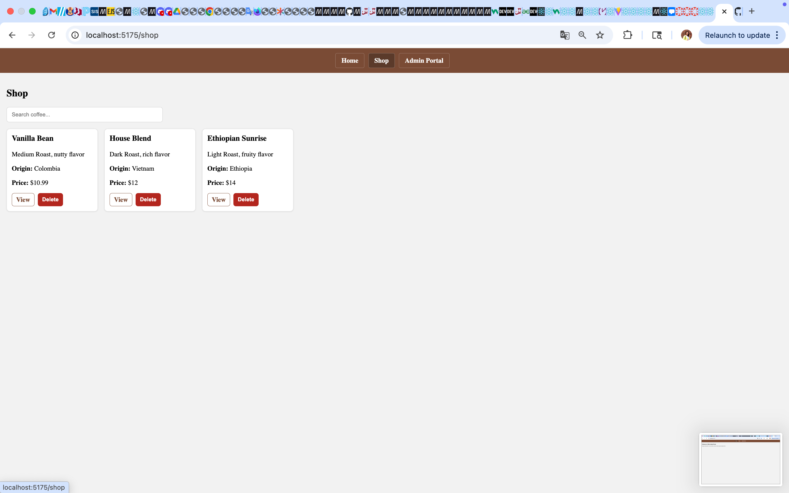

# Coffee Admin Portal

A React + Vite project with an admin panel to manage coffee products.  
Built with client-side routing, a custom hook, and unit tests.

## Features
- **Home page** – welcome screen  
- **Shop page** – list of coffees with search & delete  
- **Product page** – view and update price of a single coffee  
- **Admin page** – add new products  
- **Custom hook** `useFetch` for API requests  
- **Unit tests** for Shop, Product, and Admin components  
- **Git workflow** with feature branches and Pull Requests  

## Setup & Usage
```bash
# install dependencies
npm install

# start mock backend (json-server)
npx json-server --watch db.json --port 3001

# run development server
npm run dev

# run tests
npm test
```

Screenshots

### Home


### Shop


### Product


### Admin


### Tests


Known limitations
- Uses **json-server** as a mock API (no persistent database).  
- Styling is minimal and focused on functionality.